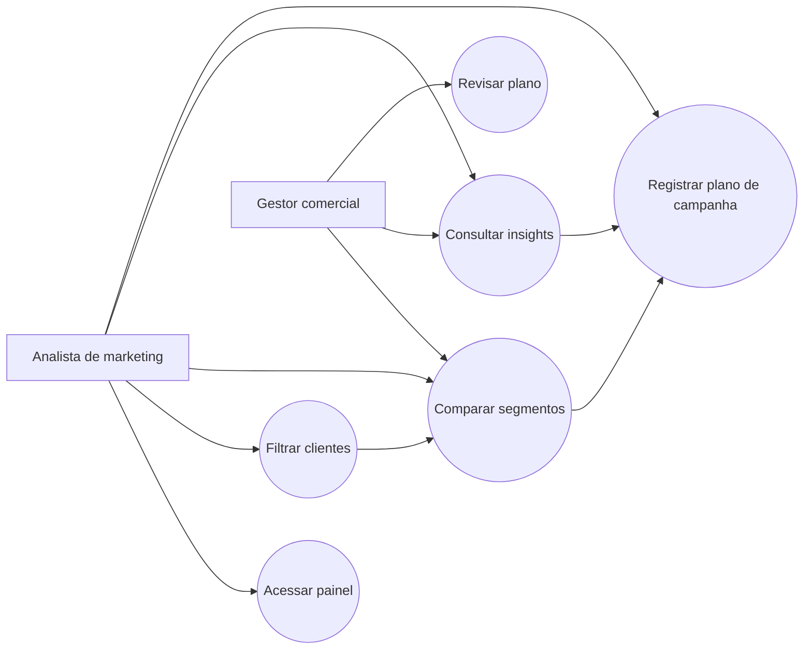
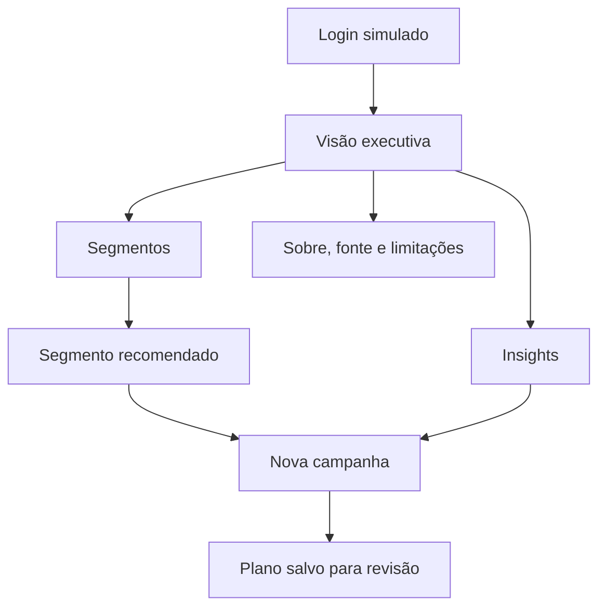
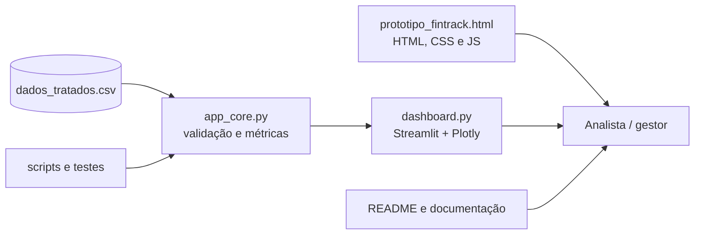

# Modelagem do FinTrack Insights

## Casos de uso

## Fluxo de navegação

## Estrutura geral

## Rastreabilidade

| Requisito | Evidência |
|---|---|
| RF01 | Tela de login do protótipo |
| RF02 | Indicadores do protótipo e dashboard |
| RF03 | Barra lateral do dashboard |
| RF04 | Gráficos e tabela de segmentos |
| RF05 | Gráfico mensal |
| RF06 | Tabela operacional |
| RF07 | Tela “Nova campanha” |
| RF08 | Expansor de metodologia e tela “Sobre” |
| RNF03 | Estado vazio no dashboard |
| RNF04 | `scripts/validar_dados.py` e `tests/test_app_core.py` |
| RNF06 | Limitações e cuidados visíveis |

